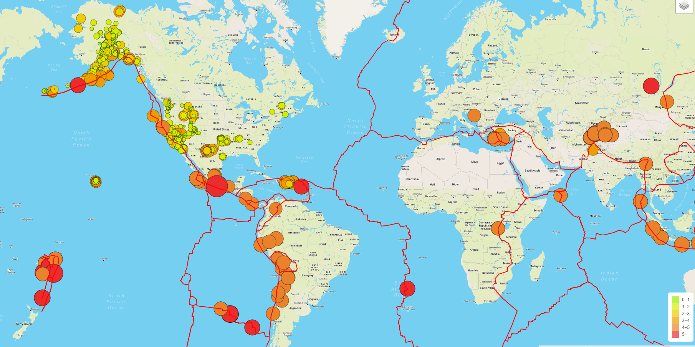
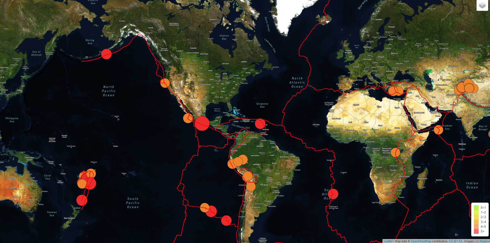

# Mapping Earthquakes

## ***Overview of Analysis:***
The purpose of this project was to utilize skills in JavaScript, HTML, and CSS to work with Mapbox and Leaflet to track and map the earthquake data collected over the past 7 days. 

## ***Results:***
The results were an interactive map that has the information on tectonic plate location, size and location of recent earthquakes, and major earthquake sizes and locations. There is also the option to select or deselect this information and to use different Mapbox views, depending on user preference. 

Here are a few examples of the final process: 

